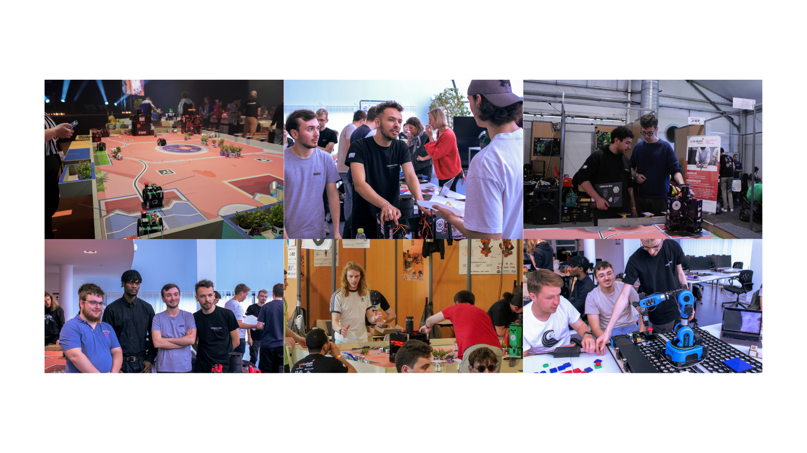

<h1><strong>Documentation</strong></h1>

<h2 style="margin-left: 30px; color: red;">L'Importance de la Documentation Visuelle pour la Promotion</h2>

Dans un monde où l'image est reine, la documentation visuelle d'événements par des photos et des vidéos est devenue indispensable pour toute stratégie de promotion efficace. Qu'il s'agisse de conférences, de salons professionnels, de lancements de produits ou de festivals culturels, capturer ces moments clés permet de maximiser la visibilité et l'impact de vos activités. Voici pourquoi une bonne documentation visuelle est cruciale et comment elle peut être bénéfique pour votre organisation.

<h3 style="margin-left: 50px;">Créer un Impact Visuel</h3>

Les photos et les vidéos captent instantanément l'attention. Contrairement aux textes, les éléments visuels peuvent raconter une histoire en un clin d'œil. Une image bien cadrée ou une séquence vidéo dynamique peut transmettre l'ambiance, l'énergie et l'importance de votre événement de manière plus vivante et mémorable. Cela aide à créer une connexion émotionnelle immédiate avec votre audience.

<h3 style="margin-left: 50px;">Améliorer la Communication et l'Engagement</h3>

Les supports visuels sont des outils puissants pour la communication. Ils rendent les messages plus clairs et plus engageants. En publiant des photos et des vidéos de vos événements sur les réseaux sociaux, votre site web ou dans des newsletters, vous pouvez susciter un engagement plus fort de la part de votre audience. Les gens sont plus enclins à liker, partager et commenter des contenus visuels, augmentant ainsi la portée de votre message.

<h3 style="margin-left: 50px;">Renforcer la Crédibilité et la Confiance</h3>

Des images et des vidéos de haute qualité montrent votre professionnalisme et votre attention aux détails. Elles témoignent de la réussite de vos événements passés et renforcent votre crédibilité auprès de vos partenaires, clients et prospects. La documentation visuelle prouve que vous tenez vos promesses et que vous organisez des événements mémorables et bien exécutés.

<h3 style="margin-left: 50px;">Créer du Contenu Durable et Réutilisable</h3>

Les photos et les vidéos constituent un excellent contenu durable. Elles peuvent être utilisées non seulement pour promouvoir des événements passés, mais aussi pour des campagnes futures. Un événement bien documenté devient une ressource précieuse de contenu que vous pouvez recycler pour des teasers, des rétrospectives, des témoignages et d'autres supports marketing.

