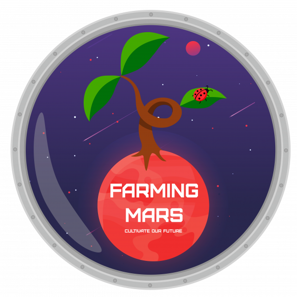
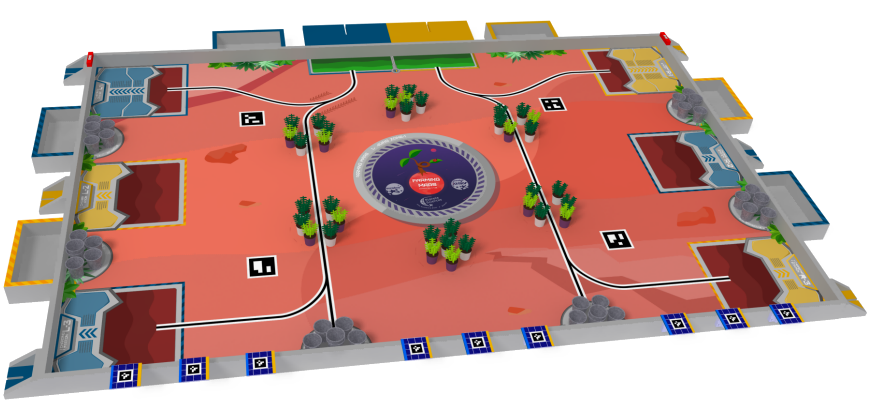

<h1 style="width: 80%;"><strong>La Coupe de France de Robotique : C'est quoi ?</strong></h1>

<h2 style="color: red;"><strong> Une Compétition Planète Science</strong></h2>

<!--Insérer logo planète science, oryon et autres sponsors

Verification Texte à faire-->

<h2 style="color: red;"><strong> Thème 2024 : Farming Mars !</strong></h2>

Notre planète Terre devient de plus en plus inhospitalière pour toute forme de vie. Par conséquent, notre objectif est de trouver une autre planète capable d'accueillir l'humanité. Par chance, il y en a une juste à côté de nous : Mars !

Les plus grands scientifiques de notre époque se sont unis pour rendre cette planète habitable, poursuivant divers objectifs ambitieux :

<ul style="margin-left: 60px;">
    <li>Rempoter les plantes et les mettre en culture</li>
    <li>Orienter les panneaux solaires pour que la serre ne perde pas d’énergie </li>
    <li>Assurer la pollinisation des plantes</li>
    <li>Retourner se recharger les batteries, à la fin de la journée de travail </li>
    <li>Anticiper le futur rendement de la récolte</li>
</ul>

<h3 style="margin-left: 20px;">Terrain de jeu :</h3>

 

    

        
    

    

        <!-- vidéo -->
    

 

<h2 style="color: red;"><strong>Présentation des équipes</strong></h2>

<h3 style="margin-left: 20px;">Innovatronic</h3>
<h3 style="margin-left: 20px;">Robot Automatisé Transporteur de Plantes - RATP</h3>
<h3 style="margin-left: 20px;">Unimakers - tout court</h3>
<h3 style="margin-left: 20px;">Unimakers Legends</h3>
