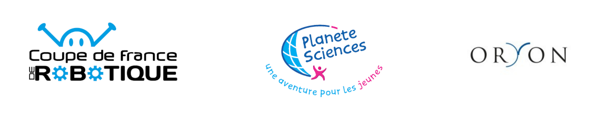

<h1 style="width: 80%;"><strong>La Coupe de France de Robotique : C'est quoi ?</strong></h1>

<h2 style="color: red;"><strong> Une Compétition Planète Science</strong></h2>

La Coupe de France de Robotique est un défi excitant qui attire les passionnés de robotique, ainsi que les enseignants cherchant à promouvoir cette discipline auprès des jeunes. Les équipes, composées de plusieurs membres, doivent concevoir et construire un robot autonome conforme aux règles de la compétition. Cette rencontre représente l’opportunité pour les équipes de créer de nouvelles compétences à travers une expérience unique.

Les robots doivent passer par une phase d'homologation pour vérifier leur conformité aux règles. Le concours comprend une phase qualificative suivie d'une phase finale par élimination directe. Les meilleures équipes françaises auront l'opportunité de rencontrer des équipes internationales lors de la finale d'Eurobot Open.

 

 

Cette compétition est organisée par Oryon et Planète Sciences, deux acteurs majeurs dans le domaine de la robotique et de l'éducation scientifique en France. Oryon, en tant qu'agence de développement économique, apporte son soutien logistique et technique, tandis que Planète Sciences se concentre sur l'animation scientifique et la promotion de la robotique auprès des jeunes. Ensemble, ils font de cet événement un rendez-vous incontournable pour les amateurs de robotique.

<h2 style="color: red;"><strong> Thème 2024 : Farming Mars !</strong></h2>

 

Notre planète Terre devient de plus en plus inhospitalière pour toute forme de vie. Par conséquent, notre objectif est de trouver une autre planète capable d'accueillir l'humanité. Par chance, il y en a une juste à côté de nous : Mars !

Les plus grands scientifiques de notre époque se sont unis pour rendre cette planète habitable, poursuivant divers objectifs ambitieux :

<ul style="margin-left: 60px;">
    <li>Rempoter les plantes et les mettre en culture</li>
    <li>Orienter les panneaux solaires pour que la serre ne perde pas d’énergie </li>
    <li>Assurer la pollinisation des plantes</li>
    <li>Retourner se recharger les batteries, à la fin de la journée de travail </li>
    <li>Anticiper le futur rendement de la récolte</li>
</ul>

 

    

        
    

    

        <iframe width="100%" height="auto" style="aspect-ratio: 16/9;" src="https://www.youtube.com/embed/eUOgDKmpZKw" title="YouTube video player" frameborder="0" allow="accelerometer; autoplay; clipboard-write; encrypted-media; gyroscope; picture-in-picture; web-share" allowfullscreen></iframe>
    

 

<h2 style="color: red;"><strong>Présentation des équipes</strong></h2>

Pour cette nouvelle édition, Unimakers présente quatre équipes composées de 22 étudiants au total. Ces 22 étudiants sont motivés à relever le défi et à mettre à profit leurs connaissances dans cette nouvelle expérience.

<h3 style="margin-left: 20px;">Innovatronic</h3>

Innovatronic est une équipe de première année, discrète et désireuse d'explorer de nouveaux domaines de compétences. Pour eux, cette compétition visait à découvrir de manière plus concrète le monde de la robotique à travers un projet tangible.

<h3 style="margin-left: 20px;">Robot Automatisé Transporteur de Plantes - RATP</h3>
<h3 style="margin-left: 20px;">Unimakers - tout court</h3>
<h3 style="margin-left: 20px;">Unimakers Legends</h3>
