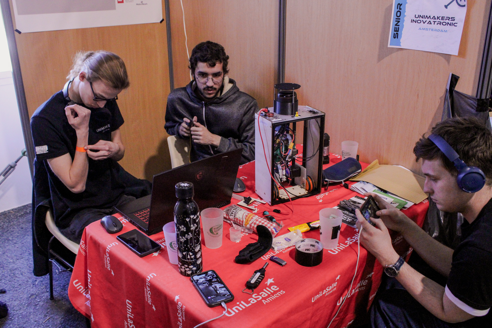
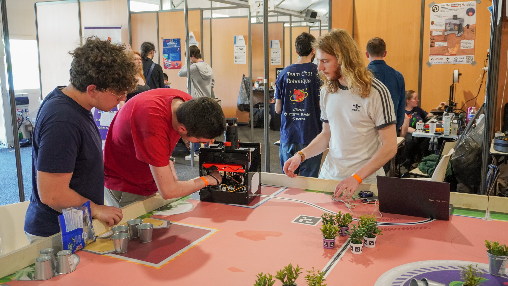
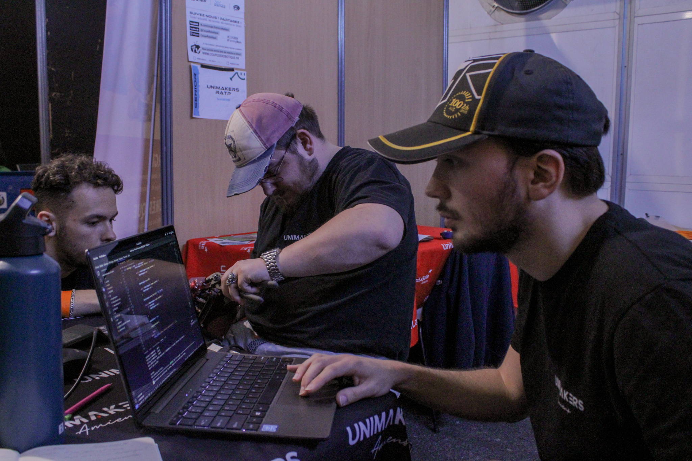
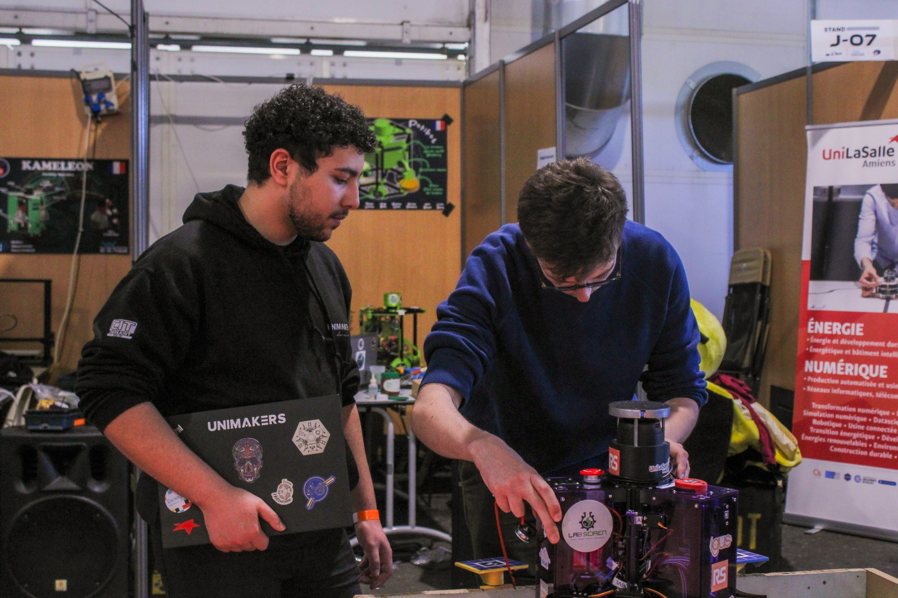

<h2 style="color: red;"><strong>Présentation des équipes</strong></h2>

Pour cette nouvelle édition, Unimakers présente quatre équipes composées de 22 étudiants au total. Ces 22 étudiants sont motivés à relever le défi et à mettre à profit leurs connaissances dans cette nouvelle expérience.

<h3 style="margin-left: 20px;">Innovatronic</h3>

 

    

        
    

    

    
Innovatronic est une équipe de première année, discrète et désireuse d'explorer de nouveaux domaines de compétences. Pour eux, cette compétition visait à découvrir de manière plus concrète le monde de la robotique à travers un projet tangible.

    

 

Malgré des débuts laborieux, Innovatronic a surmonté les obstacles et obtenu l'homologation de son robot lors de la dernière journée de compétition, participant même à un match ! Cette réussite était particulièrement remarquable pour une équipe de première année. Ils ont finalement décroché la 77e place sur 95 équipes présentes. Félicitations à eux pour cette performance !

 

<h3 style="margin-left: 20px;">RATP - Robot Automatisé Transporteur de Plantes </h3>

 

    

        
À l'instar d'Innovatronic, la RATP a également rencontré des difficultés lors de la compétition et a pris du retard, ne parvenant qu'à atteindre l'avant-dernière série de matchs. Lors de leur premier match, ils sont repartis bredouilles, n'ayant marqué aucun point. Cependant, ils ont su rebondir au second match en inscrivant 66 points et en se classant 61èmes.

    

    

        
    

 

 La stabilité de leur robot a été démontrée lors de matchs amicaux organisés à leur retour à l'école<em><strong>L'année prochaine, l'équipe RATP sera un adversaire redoutable, alors méfiez-vous d'eux !</strong></em>

<h3 style="margin-left: 20px;">Unimakers - tout court</h3>

 

    

        
    

    

    
Unimakers est notre équipe de troisième année. Ces étudiants ont réussi à homologuer leur robot dès le premier jour, démontrant ainsi leur efficacité et leur préparation minutieuse pour la compétition. Ils ont ensuite continué à affiner leur stratégie et à peaufiner leur robot tout au long de l'événement, montrant un engagement envers la performance.
    

    

 

Cette équipe a brillé lors de la compétition, en se frayant un chemin au fil des matchs avec une détermination remarquable. Leur travail assidu et leur engagement sans faille les ont propulsés vers les sommets, leur permettant ainsi de se qualifier pour la finale en se classant à la 16ème place. Félicitations à eux pour cette performance exceptionnelle ! Maintenant, direction le podium où de nouvelles victoires les attendent !

<h3 style="margin-left: 20px;">Unimakers Legends</h3>

 

    

        
Unimakers Legends, notre équipe de quatrième année, participe pour la deuxième fois à la compétition. Cette année, ils se sont lancé un défi ambitieux : adapter leur robot en moins d'une semaine. Bien que leurs débuts aient été légèrement périlleux, ils ont réussi à homologuer leur robot et à passer aux matchs !

    

    

        
    

 

Grâce à leurs efforts, l'équipe a réussi à obtenir des résultats significatifs au cours des différentes séries. Avec un score progressif, culminant à 201 points dans la quatrième série, ils ont démontré leur capacité à s'adapter rapidement et à améliorer constamment leurs performances. Ces résultats leur ont permis de se classer à la 28ème place, un accomplissement remarquable compte tenu des défis techniques et du temps limité dont ils disposaient.
