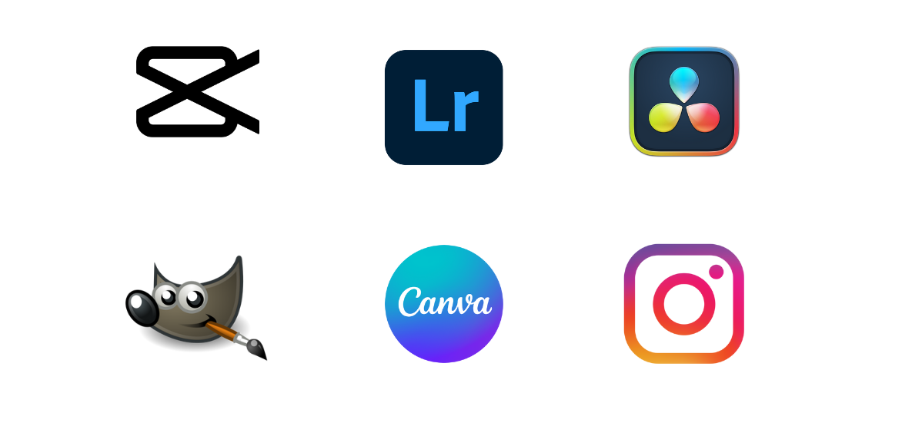

<h2 style="color: red;"><strong>Ma Stratégie : Objectifs et Outils Utilisés</strong></h2>

<h3 style="margin-left: 40px;">Objectifs</h3>

Mon objectif pour cette nouvelle édition de la Coupe de France de Robotique est clair : je vise à accroître la visibilité de nos équipes afin de faciliter la recherche de sponsors pour les années à venir. Mon intention est de renforcer la crédibilité de nos équipes ainsi que celle de notre école.

Je désire également que les étudiants puissent conserver une trace de leur participation, afin de créer un souvenir mémorable de cette expérience unique.

<h3 style="margin-left: 40px;">Outils Utilisés</h3>

Pour simplifier mes tâches et améliorer ma productivité, j'ai choisi Lightroom pour l'édition de photos, Canva pour la création de designs, Instagram pour le partage de contenu, CapCut pour le montage vidéo, GIMP pour la retouche d'images et DaVinci Resolve pour le montage et l'étalonnage avancés. 

    

 

<h2 style="color: red;"><strong>La Communication en quelques chiffres</strong></h2>

<!--Nbr photos, vidéos, tps passé-->