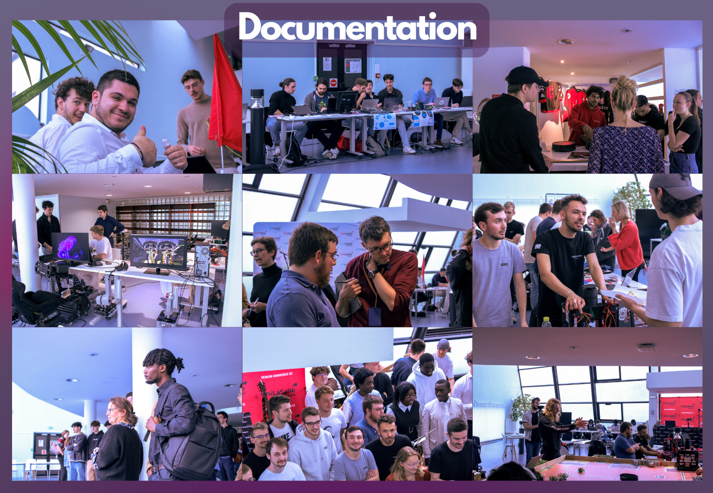

<h3 style="margin-left: 30px;">Sommaire - Liste des projets classés par événement :</h3>

<nav style="background-color: #E5E2E2;">
    <ul>
        <li><a href="#section1" style="color: black;">Coupe France de Robotique 2024</a></li>
        <li><a href="#section2" style="color: black;">Journée des Projets</a></li>
    </ul>
</nav>

<h2 id="section1" style="color: red;"><strong>Coupe de France de Robotique 2024</strong></h2>

<h3 style="margin-left: 30px;">Mise en place d'une base de données : Photos et vidéos </h3>

<h3 style="margin-left: 30px;">Vidéo Instagram : He's back </h3>

<h3 style="margin-left: 30px;">Introduction de Vidéo </h3>

<h3 style="margin-left: 30px;">Interview Unimakers (tout court) </h3>

<h3 style="margin-left: 30px;">Création d'un Magazine</h3>

<h2 id="section2" style="color: red;"><strong>Journée des Projets</strong></h2>

<h3 style="margin-left: 30px;">Présentation Journée des projets : Cadrage et Script </h3>

  <iframe width="560" height="315" src="https://www.youtube.com/embed/UPZuvqIs5k4" title="YouTube video player" frameborder="0" allow="accelerometer; autoplay; clipboard-write; encrypted-media; gyroscope; picture-in-picture" allowfullscreen></iframe>

<h3 style="margin-left: 30px;">Mise en place d'une base de données : Photos et vidéos </h3>

<h4 style="margin-left: 50px;"><strong>Quel est l'intérêts de créer une documentation?</strong></h4>

La création d'une documentation photographique est d'une importance capitale. Elle assure l'archivage visuel de moments et d'événements significatifs, facilitant une communication efficace des informations. De plus, elle joue un rôle essentiel dans la promotion, conférant une crédibilité indispensable pour les événements à venir.

<h3 style="margin-left: 30px;">Vidéo Promotionnelle (1:30) </h3>

Cette vidéo a pour objectif de mettre en avant l'équipe Unimakers lors de la journée des projets, en attirant l'attention du public et du jury pour les inciter à visiter le stand. Sa conception est simple, avec une réflexion visant à organiser les vidéos dans un ordre chronologique afin de suivre le parcours de l'équipe lors de la Coupe de France de robotique.

  <iframe width="100%" height="auto" style="max-width: 800px; width: 100%; height: auto;" src="https://www.youtube.com/embed/7D-iiri6Bs4" title="YouTube video player" frameborder="0" allow="accelerometer; autoplay; clipboard-write; encrypted-media; gyroscope; picture-in-picture" allowfullscreen></iframe>

