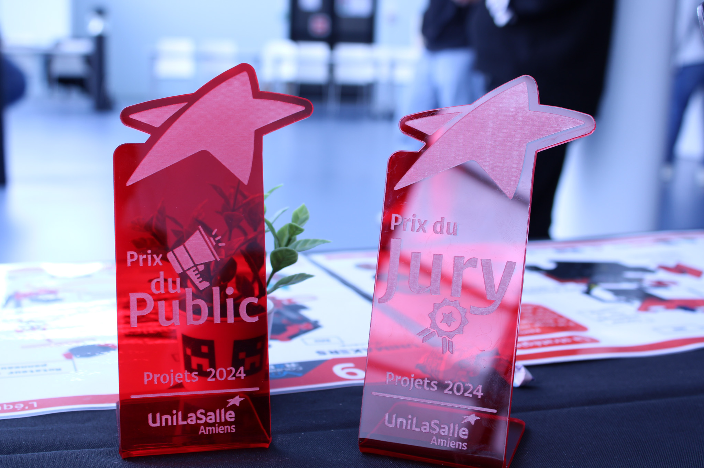

<h1><strong>Journée des Projets</strong></h1>

<h3 style="margin-left: 30px; color: red;">Vidéo Promotionnelle (1:30) </h3>

<h4 style="margin-left: 50px;">- Objectifs </h4>

Cette vidéo a pour objectif de mettre en avant l'équipe Unimakers lors de la journée des projets, en attirant l'attention du public et du jury pour les inciter à visiter le stand. Sa conception est simple, avec une réflexion visant à organiser les vidéos dans un ordre chronologique afin de suivre le parcours de l'équipe lors de la Coupe de France de robotique.

  <iframe width="560" height="315" src="https://www.youtube.com/embed/7D-iiri6Bs4" title="YouTube video player" frameborder="0" allow="accelerometer; autoplay; clipboard-write; encrypted-media; gyroscope; picture-in-picture" allowfullscreen></iframe>

<h4 style="margin-left: 50px;">Résultats Obtenus</h4>

    

        
    

    

    
La réalisation de cette vidéo a véritablement attiré l'attention du public et a conduit à une augmentation de l'affluence au stand. Cette visibilité accrue de l'équipe Unimakers a joué un rôle déterminant dans l'obtention du prix du jury et du public !

 

<strong>Félicitations à toutes l'équipe Unimakers !</strong>
