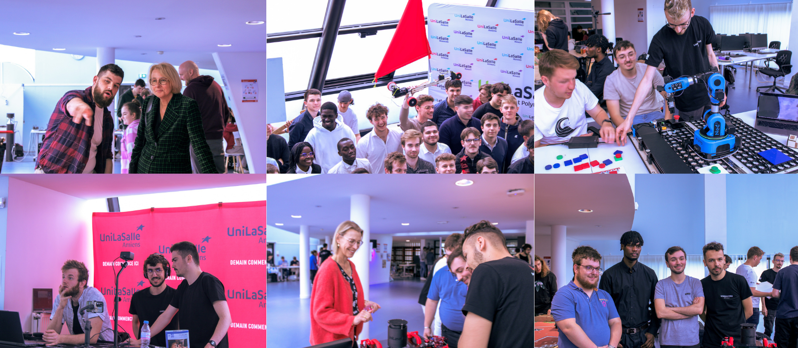

<h1><strong>La Journée des Projets : 29 mai 2024 !</strong><h1>

<h2 style="color: red;"><strong>Un Moment d'Echanges</strong></h2>

Le 29 mai 2024, l'École d'Ingénieurs d’Unilasalle Amiens a organisé sa Journée des Projets, un événement annuel majeur destiné à mettre en lumière les travaux de recherche et les projets innovants des étudiants. Cet événement a rassemblé étudiants, professeurs, professionnels du secteur et invités d'honneur, offrant une plateforme unique pour l'échange de connaissances et la valorisation des talents émergents.

<h2 style="color: red;"><strong>Mes Missions et Résultats Obtenus</strong></h2>

<a href="../creations.md">Cliquez ici pour retrouver toutes mes créations</a>
 <!--à revoir-->

En amont de la Journée des Projets, j'ai pris en charge la création d'un teaser pour promouvoir l'événement. En collaboration avec mon camarade Dylan Looij, nous avons élaboré le script et assuré une vidéo de qualité, mettant en valeur les moments forts et les aspects uniques de cette journée.

Pendant la Journée des Projets, j'ai été responsable de la prise de photos et de la création d'une vidéo publicitaire. Ces supports ont permis de mettre en avant l'équipe Unimakers, qui a brillamment participé à la Coupe France de Robotique 2024. Grâce à mon travail, l'événement a bénéficié d'une couverture visuelle attractive et professionnelle, mettant en lumière les compétences et les innovations de notre équipe. Les retours ont été très positifs, tant de la part des participants que des organisateurs.

<h3 style="margin-left: 40px;">Ce que cela m'a apporté</h3>

 

Cet engagement dans la réalisation du teaser en amont de la Journée des Projets et dans la couverture visuelle pendant l'événement m'a offert une expérience précieuse en matière de communication et de production audiovisuelle. J'ai pu développer mes compétences dans la création de contenu multimédia, de la planification à la post-production. De plus, cela m'a permis de renforcer ma capacité à travailler de manière autonome et à gérer efficacement les tâches assignées. Cette expérience m'a également donné l'occasion de collaborer étroitement avec mes pairs, ce qui a favorisé un environnement de travail dynamique et stimulant. Enfin, voir le résultat de mon travail contribuer de manière significative à la réussite de l'événement a été une source de satisfaction personnelle et de motivation pour continuer à développer mes compétences dans ce domaine.
