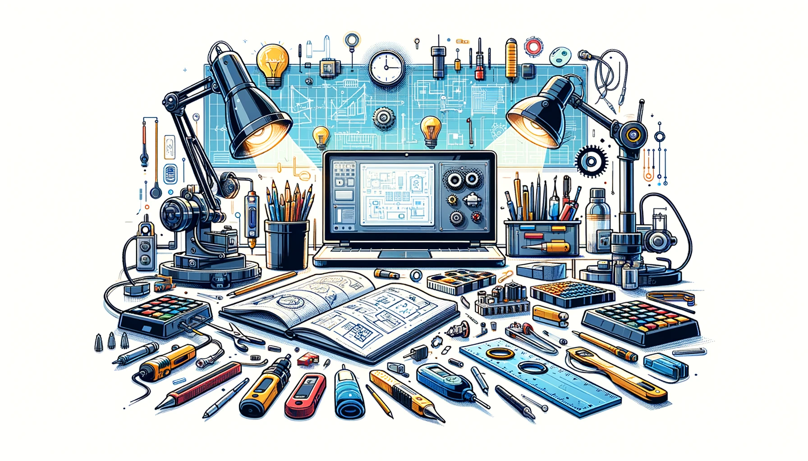

# Explorez ma documentation !

<h2 style="color: red;">À propos de moi</h2>

body { Ce site vise à fournir une documentation technique complète sur mon parcours en tant que responsable communication pour les équipes de la Coupe de France Robotique. Il partage les réalisations et les projets que j'ai menés, offrant ainsi des exemples concrets de bonnes pratiques en communication dans le domaine de la robotique. En documentant les étapes clés du processus, il aspire à être une ressource précieuse pour les autres responsables de communication, tout en favorisant l'échange et la collaboration au sein de la communauté. En partageant mes expériences, je souhaite inspirer et motiver d'autres passionnés de robotique à développer leurs compétences en communication. Enfin, ce site vise à établir ma crédibilité et mon expertise dans ce domaine en constante évolution.: justify; }

## Qui je suis ? 

<video src="images/intro_amiens.mp4" controls title="Title"  style="width: 100%;"></video>
