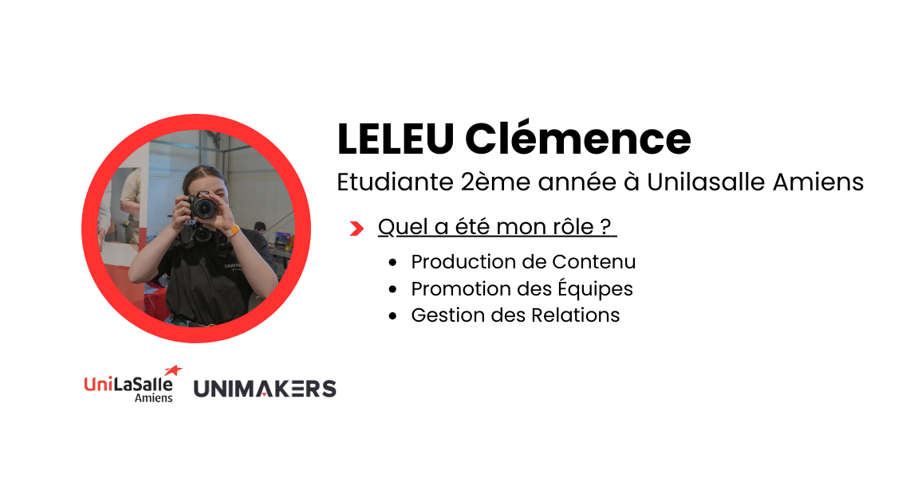

<h1><B>Explorons ma documentation !</B> </h1>

<h2 style="color: red;"> Ce que vous retrouverez </h2>

   
Ce site vise à fournir une documentation technique complète sur mon parcours en tant que responsable communication pour les équipes de la Coupe de France Robotique. Il partage les réalisations et les projets que j'ai menés, offrant ainsi des exemples concrets de bonnes pratiques en communication dans le domaine de la robotique. En documentant les étapes clés du processus, il aspire à être une ressource précieuse en ce qui concerne l'échange et la collaboration au sein de la communauté. En partageant mes expériences, je souhaite inspirer et motiver d'autres passionnés de robotique à développer leurs compétences en communication.

<!-- Mettre photos avec les icones -->

<h2 style="color: red;"> A propos de moi : <em>Qui je suis ?</em> </h2>

 
En tant qu'étudiante ingénieur en deuxième année à Unilasalle Amiens, ma passion pour les sujets scientifiques, notamment la robotique, est indéniable. Au cours de l'année scolaire 2023-2024, j'ai eu l'opportunité de participer à la Coupe France de Robotique 2024 à La Roche-sur-Yon en tant que Responsable Communication. Cette expérience m'a permis de mettre en pratique mes compétences en communication tout en contribuant activement à la promotion et à la représentation de nos équipes et de notre institution. De plus, cela a également renforcé ma passion pour la photo et la vidéo. 
 

<h3 align="Center"><B>Prêt à explorer la suite ?</B></h3>
<h4 style="color: #353535; text-align: center;">Jette un coup d'œil au tableau de bord sur ta gauche !</h4>

